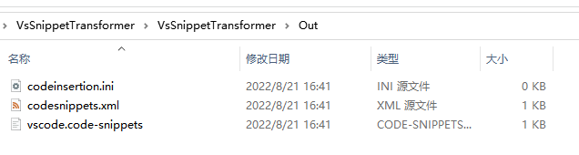
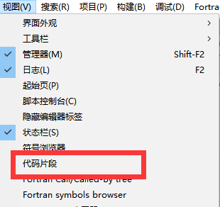
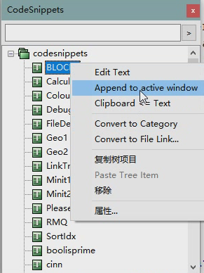
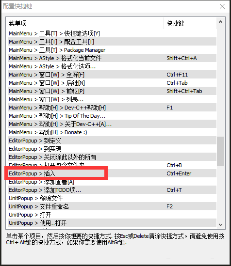
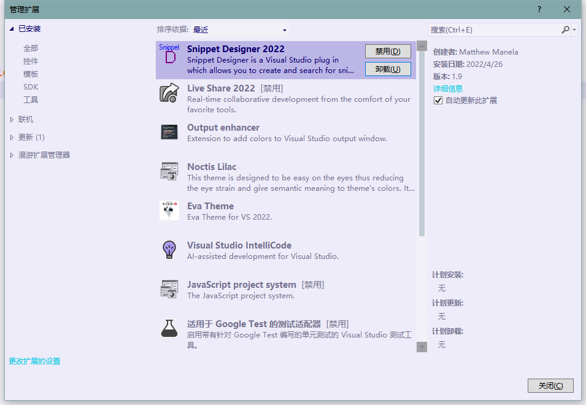

# VsSnippetTransformer
>这是一个将Visual Studio的代码片段转化为Visual Studio Code、CodeBlocks、DevCPP 的代码片段的脚本
>
>This is a script that converts snippets of Visual Studio into snippets of Visual Studio Code, CodeBlocks, and DevCPP

## 使用方法

将Visual Studio的代码片段放入本项目的 `Snippets` 文件夹内，运行相应脚本，整合的代码片段位于 `Out` 文件夹中

### Visual Studio Code 代码片段 使用方法：

>设置为全局代码片段：
>
>>将`Out`中的`vscode.code-snippets`放到 `C:\Users\你的用户名\AppData\Roaming\Code\User\snippets\中`
>
>设置为项目代码片段：
>
>> 将`Out`中的`vscode.code-snippets`放到 `VsCode项目中的.vscode中`
>
>在项目代码中输入相应快捷键，按Tab即可将片段输出到光标

### CodeBlocks  代码片段 使用方法：

>将`Out`中的`codesnippets.xml`放到 `C:\Users\你的用户名\AppData\Roaming\CodeBlocks\中`
>
>进入项目顶栏 ---> 视图 ---> 代码片段
>
> 
>
> 
>
>点击 Append to active window 即可将片段输出到光标

### DevCPP  代码片段 使用方法：

>将`Out`中的`codeinsertion.ini `放到 `C:\Users\你的用户名\AppData\Roaming\Dev-Cpp\`中
>
>在项目中找到 `"插入的快捷键"` 
>
>如图，本人是`Ctrl + Enter` 可以自己设置，在项目中，敲击该快捷键，在屏幕左侧可看到所有可用代码片段，点击相应片段即可将片段输出到光标

## 不知道自己的 Visual Studio 代码片段在哪？

>一般来说在`C:\Users\你的用户名\Documents\Visual Studio 2022\Code Snippets\Visual C++\My Code Snippets`

## 没有 Visual Studio 代码片段？

>安装这个拓展，在项目中右键，点Export as Snippet，输入代码，在顶部设置 `"文件名"` `"语言"` `"快捷键"` 再 `Ctrl + s `保存即可
>
> 

